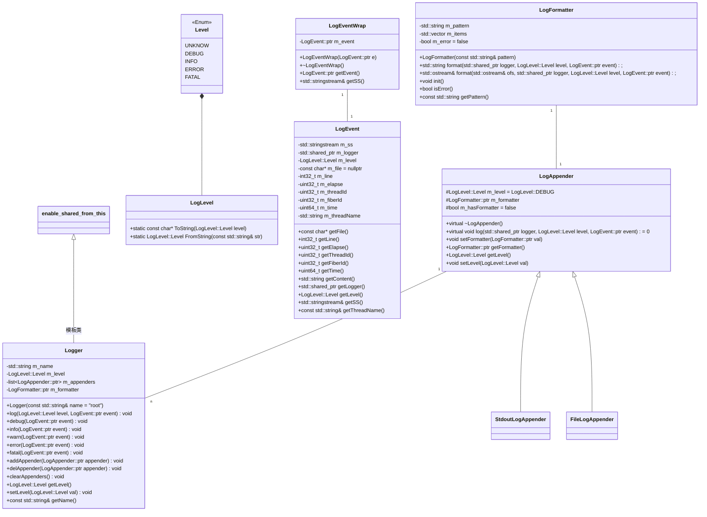

# sylar

## 开发环境

Ubuntu20.04
gcc 9.4.0
cmake

## 项目路径

bin -- 存放二进制
build -- 中间文件路径
cmake -- cmake函数文件夹
CMakeLists.txt -- cmake的定义文件
lib -- 库的输出路径
Makefile
sylar -- 源代码路径
tests -- 测试代码路径

## 日志系统

1.

Log4J

```cpp
Logger(定义日志类别)
   |
   | ------Formatter(日志格式)
   |
Appender(日志输出地方)
```

什么是日志系统?
Log像一台全天24小时开启的摄像头，记录服务器上各种重要事务的状态，有了Log，才可以在事后快速的知道出现问题的所在。例如用户在登录失败时，Log记录下来失败时输入的账号。
什么是Log4J?
全名是Apache Log4J, 是Java程式语言的Log套件(框架)，提供方便的日志记录。

## 协程库封装

## socket函数库

## http协议开发

## 分布协议

## 推荐系统

# 开发过程中使用到的技术

## C++ 11

### shared\_ptr 智能指针

在实际的C++开发中，我们经常会碰到程序突然崩溃、所使用内存越来越大，最终不得不重启等问题，这些问题往往是由于内存资源管理不当造成的。
比如：

*   有些内存资源已经释放，但指向它的指针没有改变指向(成为了野指针)，并且后续还在使用。
    *   出现野指针的常见情况：

        *   使用未初始化的指针

        ```cpp
        #include <iostream>
        using namespace std;
        int main() {
            int* p;
            cout << *p << endl; //编译通过，运行时出错
        }
        ```

        *   指针所指对象已经消亡(生命周期结束)

        ```cpp
        #include <iostream>
        using namespace std;

        int* retAddr() {
            int num = 10;
            return &num;
        }

        int main() {
            int* p = NULL;
            p = retAddr();
            cout << &p << endl;
            cout << *p << endl; // runtime error：load of null pointer of type 'int'
        }
        ```

        *   指针释放后之后未置空
*   有些内存资源已经释放，后续还在尝试释放(重复释同一块内存会导致程序运行崩溃)。
*   没有即使释放不再使用的内存资源，造成内存泄漏，程序占用内存资源越来越多。

C++11新标准增添了unique\_ptr、shared\_ptr 以及 weak\_ptr 这 3 个智能指针来实现堆内存的自动回收。
**什么是智能指针？**
所谓智能指针，从字面意思上来看就是“智能的”指针。其使用方法和普通指针相似，但其在适当时机可以自动的释放分配的内存。使用智能指针可以很好的避免“因为忘记释放而导致的内存泄露”的问题

> C++智能指针底层采用引用计数的方式实现的。简单的理解，智能指针在申请堆内存时，会为其配备一个整型值（初始值为1），每当有新对象使用该堆内存时，该整型值+1; 反之，每当使用此堆内存的对象释放时，该整型值-1。当堆空间对应的整型值为0时，即表明不再有对象使用它，该堆空间就会被释放掉。

**shared\_ptr\<T> 定义位于\<memory>头文件中, 并位于std命名空间中。**

shared\_ptr 和 unique\_ptr, weak\_ptr 不同点在于：
多个shared\_ptr智能指针可以同时指向同一块堆内存空间, 由于其在实现上采用引用计数的机制，即便有一个shared\_ptr智能指针放弃了对堆内存的“使用权”(引用计数-1), 也不会影响其他指向同一块堆内存的shared\_ptr智能指针（只有引用计数为 0 时，堆内存才会被自动释放）。

## std::function 和 std::bind

`std::function`是通用多态函数封装器。`std::function`的实例能存储、复制及调用任何可调用目标——— 函数，`lambda`表达式，`bind`表达式或者其他函数对象，还有指向成员函数指针和指向数据成员指针。

## C++ 常见软件注释规范Doxygen

## 宏定义(带参宏定义)

无参数宏定义的格式为：`#define 标识符 替换列表`

*   使用标识符表示一常量

宏定义不是语句，是预处理指令，不能有`;`。
续行符`\`后直接按`Enter`换行，**不能**含有包括空格在内的任何字符，否则是错误的宏定义形式。
带参数的宏定义格式为：`#define 标识符(参数1,参数2,...,参数n) 替换列表`
删除宏定义的格式为：`#undef 标识符`

### 带参宏定义VS函数调用

1.  调用的发生时间：
    *   在源程序进行编译之前，即预处理阶段进行宏替换；
    *   函数调用则发生在程序运行期间。

2.  参数类型检查
    *   函数参数类型检查严格。程序在编译阶段，需要检查实参与形参个数是否相等及类型是否匹配或兼容，若有问题则会编译不通过。
    *   在预处理阶段，对带参宏调用中的参数不做检查。即宏定义时不需要指定参数类型，既可以认为这是宏的优点，即适用于多种数据类型，又可以认为这是宏的一个缺点，即类型不安全。故在宏调用时，需要程序设计者自行确保宏调用参数的类型正确。

3.  参数是否需要空间
    *   函数调用时，需要为形参分配空间，并把实参的值复制一份赋给形参分配的空间中。
    *   而宏替换，仅是简单的文本替换，且替换完就把宏名对应标识符删除掉，即不需要分配空间。

4.  执行速度
    *   函数在编译阶段需要检查参数个数是否相同、类型等是否匹配等多个语法，而宏替换仅 是简单文本替换，不做任何语法或逻辑检查。

    *   函数在运行阶段参数需入栈和出栈操作，速度相对较慢。

5.  代码长度
    *   由于宏替换是文本替换，即如果需替换的文本较长，则替换后会影响代码长度；而函数不会影响代码长度。

**故使用较频繁且代码量较小的功能，一般采用宏定义的形式，比采用函数形式更合适。** 前面章节频繁使用的getchar()，准确地说，是宏而非函数。

```c
#define getchar() getc(stdin)
```

### 关于#和#\#

**#的功能是 将其后面的宏参数进行字符串化操作。**

## 枚举LogLevel

**为什么在类中可以直接通过`类名::enum值`?**
该枚举是一个常量，在编译的时候已经放入到了常量区。调用的时候不需要枚举的类型也能调用。

## typedef in class

在类内部typedef，该类型别名的作用域仅在类内，和变量，函数一样具有作用域
该定义在该类的子类中可以得到继承，可以在子类中使用该新类型定义新变量和函数。

## 带默认形参的函数

1.有默认值的形参必须在形参列表的最后: 函数调用中,实参与形参按从左到右的顺序建立对应关系
2.相同作用域内,不允许在同一个函数的多个声明中对同一个参数的默认值重复定义,值相同也不行
3.函数在定义之前有原型声明,默认形参值在原型声明中给出,定义中为了清晰可用注释形式/\* \*/

## std::enable\_shared\_from\_this (C++ 11)

一般来说，不建议函数直接返回this指针，如果返回的this指针被存到外部的一个局部/全局变量，当对象被析构后，外部变量并不能知道指针指向的对象已经被析构了，此时外部使用了这个指针就会发生程序崩溃，这种情况，既要像指针操作对象一样，又能够安全的析构对象，就应该使用智能指针。

std::enable\_shared\_from\_this 是一个模板类，子类继承enable\_shared\_from\_this模板类之后，通过shared\_from\_this() 成员函数来获取目标类型。

# test.cpp时序图

## new 直接初始化(direct initialization)

1.  创建logger对象
2.  为logger对象的属性m\_formatter成员分配内存，并执行初始化->init()
3.  init() 解析\*\*"%d{%Y-%m-%d %H:%M:%S}%T%t%T%N%T%F%T\[%p]%T\[%c]%T%f:%l%T%m%n"\*\*
4.  为logger创建标准输出appender
5.  执行StdoutAppender的构造函数
6.  局部变量LogEventWrap构造函数动态创建一个LogEvent对象, 超出生命周期时调用LogEventWrap的析构函数: 成员属性m_event的m_logger调用log函数, 传入event级别和event
7.  m_logger遍历他的appender,调用每一个appender的log(), 把自己, 日志级别, 日志事件传入
8.  m_appender调用m_formatter的format()
9.  m_formatter遍历每一个m_item,调用对应的format


    logger调用StdoutAppender的log
    它std::cout 输出 继承自LogAppender的类LogFormatter成员变量m\_formatter的format()函数的值,返回值是string

# 类图



# c复习

**程序从源程序到可执行程序经历了如下几个阶段：**

*   预处理：#define #include会在这个阶段进行替换，还会根据#ifdef #ifndef 这些条件编译指令来决定哪些代码需要被编译。

    文件后缀：`.c`（源代码文件） → `.i`（预处理文件）
*   编译：编译器会将C、C++代码转换成汇编指令，生成相应的汇编代码。

    文件后缀：`.i`（预处理文件） → `.s`（汇编代码文件）
*   汇编：汇编指令被转化成机器指令

    文件后缀：`.s`（汇编代码文件） → `.o`（目标文件）
*   链接：链接器将多个目标文件和库文件组合在一起，生成可执行文件。

    文件后缀：`.o`（目标文件） → `.out` 或 `.exe`（可执行文件）

**原码/反码/补码**

&#x20;原码，反码，补码都是计算机中描述有符合整数的方法。他们的区别在于处理负数的方式不同（正数的原码-反码-补码都相同）：

*   原码：原码的最高位表示符号位，0表示正，1表示负。例如8位二进制数，01100101表示+101，11100101表示-101。

    减法麻烦，需要对符号位进行讨论
*   反码：符号位不变，其余位按位取反。

    存在正零和负零两种表示方法，在加减乘除中要考虑进位的问题。
*   补码：反码+1

    **满足一个很重要的性质：负数的补码加上其绝对值的补码等于0，即 N + (-N) = 0。**

**printf输出控制符**

| 格式控制符                       | 说明                                                                                         |
| :-------------------------- | :----------------------------------------------------------------------------------------- |
| %c                          | 输出一个单一的字符                                                                                  |
| %hd, %d, %ld                | 以**十进制**，有符号的形式输出short，int，long类型的整数                                                       |
| %hu, %u, %lu                | 以**十进制**，无符号的形式输出short，int，long类型的整数                                                       |
| %lo、%o、%lo                  | 以**八进制**，不带前缀，无符号形式输出short, int, long 类型的整数                                                |
| %#lo、%#o、%#lo               | 以**八进制**，带前缀，无符号形式输出short, int, long 类型的整数                                                 |
| %hx、%x、%lx、%hX、%X、%lX       | 以**十六进制**、不带前缀、无符号的形式输出 short、int、long 类型的整数。如果 x 小写，那么输出的十六进制数字也小写；如果 X 大写，那么输出的十六进制数字也大写 |
| %#hx、%#x、%#lx、%#hX、%#X、%#lX | 以**十六进制**、带前缀、无符号的形式输出 short、int、long 类型的整数。如果 x 小写，那么输出的十六进制数字也小写；如果 X 大写，那么输出的十六进制数字也大写  |
| %f、%lf                      | 以十进制输出float，double类型的小数                                                                    |
| %s                          | 输出一个字符串                                                                                    |
| %p                          | 以**十六进制**输出指针类型变量的值                                                                        |
| %n                          | 将已输出的字符数量存储在一个变量中                                                                          |
|                             |                                                                                            |


